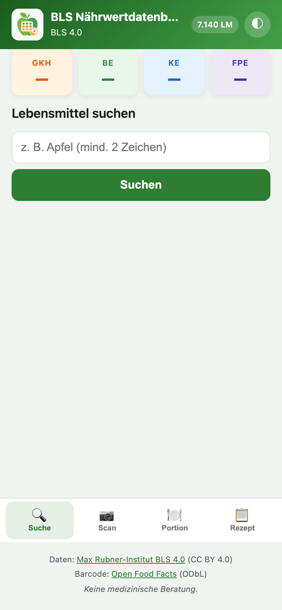
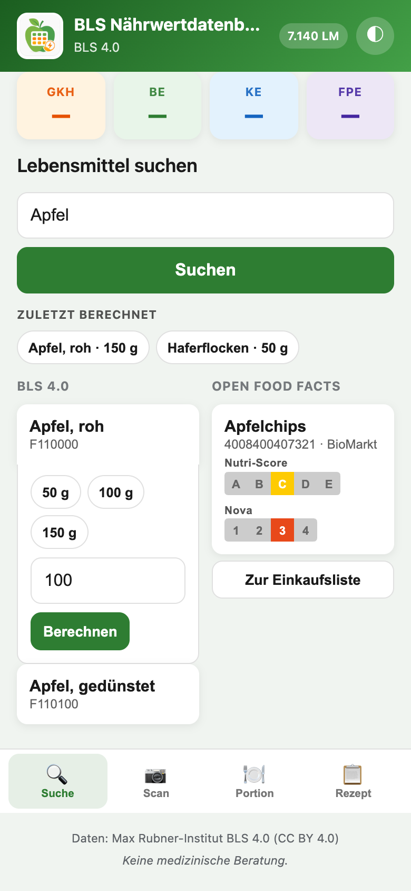
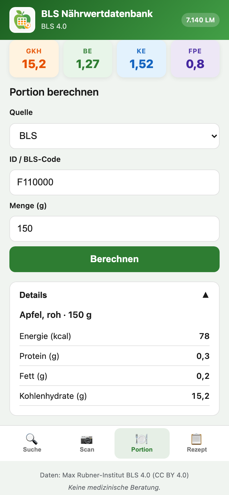

# Home Assistant Add-on: BLS Nährwertdatenbank

## About

Das Add-on stellt die deutsche BLS 4.0 Nährwertdatenbank lokal in Home Assistant bereit — mit WETID-inspirierten Diabetes-Einheiten und Barcode-Scanner über Open Food Facts.

## Einschränkungen

- BLS enthält ~7.140 Grundlebensmittel (keine 350k wie WETID)
- Barcode-Lookup benötigt Internet und deckt primär Packungsprodukte ab
- Keine Insulin-Dosierungsempfehlung — nur Nährwertberechnung

## Installation

### Add-on

1. **Einstellungen** → **Add-ons** → **Add-on Store** → Repository hinzufügen
2. **BLS Nährwertdatenbank** installieren und starten
3. Ingress-Tab öffnen oder `http://<host>:8090/health` prüfen

Beim ersten Start lädt das Add-on die BLS-Daten von [blsdb.de](https://blsdb.de/download). Das kann 5–15 Minuten dauern.

## Ingress-Web-UI (Hauptoberfläche)

Das Add-on stellt über **Ingress** eine mobil-optimierte Web-App bereit — in der Home-Assistant-App
unter **Add-ons → BLS Nährwertdatenbank → Öffnen** oder im Sidebar-Panel **BLS Nährwert**.

### Zugriff

- **Sidebar-Panel** „BLS Nährwert“ — für **alle Home-Assistant-Benutzer** sichtbar (nicht nur Admins)
- Nach einem Update das Add-on neu starten
- Fehlt der Eintrag in der Sidebar: **Add-on → Info → „Zur Sidebar hinzufügen“**



### Oberfläche im Überblick

| Bereich | Beschreibung |
|---------|--------------|
| **Header** | Logo, Titel, BLS-Version, Badge mit Anzahl Lebensmittel (z. B. „7.140 LM“) |
| **Hero-Tiles** | gKH, BE, KE, FPE — WETID-inspirierte Diabetes-Einheiten, immer sichtbar |
| **Hauptbereich** | Suche, Scan, Portion oder Rezept (je nach Tab) |
| **Bottom-Nav** | Suche · Scan · Portion · Rezept |

### Lebensmittelsuche (Dual-Column)

Parallele Suche in zwei Spalten — links **BLS 4.0** (lokal), rechts **Open Food Facts** (Internet):



1. Suchbegriff eingeben (z. B. „Apfel“) und **Suchen** tippen
2. Treffer in der passenden Spalte antippen → wechselt zur **Portion** mit vorausgefüllter Quelle und ID
3. Layout der Spalten über Add-on-Option `search_layout` steuerbar (`stacked` oder `side_by_side`)

### Portion und Ergebnis

Nach der Berechnung aktualisieren sich die Hero-Tiles. Nährwertdetails erscheinen unter **Details**:



| Schritt | Aktion |
|---------|--------|
| Quelle wählen | BLS, Open Food Facts oder eigenes Lebensmittel |
| ID / Code | BLS-Code (z. B. `F110000`) oder OFF-Barcode |
| Menge | Gramm eingeben → **Berechnen** |

### Weitere Bereiche

| Tab | Funktion |
|-----|----------|
| **Scan** | EAN/Barcode eingeben → Open-Food-Facts-Produkt laden, Menge setzen, berechnen |
| **Rezept** | Bis zu 3 Zutaten (BLS-Codes + Gramm) und Portionenanzahl |

### Nutri-Score, Nova-Score und Eco-Score

Bei **Open-Food-Facts-Produkten** zeigt die Ingress-UI optional drei Bewertungen als SVG-Badges:

| Score | OFF-Feld | Werte |
|-------|----------|-------|
| Nutri-Score | `nutrition_grades` | A–E |
| Nova-Score | `nova_group` | 1–4 |
| Eco-Score | `ecoscore_grade` / `environmental_score_grade` | A–E |

Anzeige in OFF-Suchergebnissen, nach Barcode-Scan und in den Portion-Details. BLS-Grundlebensmittel haben keine Scores.

**Rechtlicher Hinweis:** Nutri-Score ist ein eingetragenes Kollektivzeichen (Santé publique France).
Die Badges dienen der **Wiedergabe von OFF-Daten** zu Informationszwecken, nicht der eigenen Produktkennzeichnung.
Nova-Score und Eco-Score stammen ebenfalls aus Open Food Facts.

Im Lovelace-Dashboard stehen die Sensoren `sensor.bls_nutrition_nutriscore`, `_nova` und `_ecoscore` bereit.

> Das **Lovelace-Dashboard** der Integration bleibt eine separate Oberfläche für Automatisierungen
> und feste Sensoren (siehe unten).

Screenshots neu erzeugen (Maintainer): `bls_nutrition/docs/snapshots/capture.sh`

### Custom Integration

> **HACS-Hinweis:** Das Repository `henryhst/hassio-addons` ist ein **Add-on Repository**
> (`repository.json` im Root). HACS kann es **nicht** als Integration hinzufügen.

#### Option A: Manuelle Installation (empfohlen)

Kopiere den Ordner `integration/custom_components/bls_nutrition` nach
`config/custom_components/bls_nutrition` (inkl. `brand/icon.png`) und starte Home Assistant neu.

#### Option B: HACS

Verwende ein **separates** Integrations-Repository. Siehe
[`integration/README.md`](integration/README.md) für die Veröffentlichung als
eigenes GitHub-Repo (z. B. `homeassistant-bls-nutrition`).

### Integration einrichten

1. **Einstellungen** → **Geräte & Dienste** → **Integration hinzufügen**
2. **BLS Nährwertdatenbank** wählen
3. Host: `bls_nutrition` (Supervisor-intern), Port: `8090`

## Configuration

```yaml
auto_update: true
update_interval_days: 30
language: de
enable_open_food_facts: true
off_cache_ttl_days: 90
search_layout: stacked
```

| Option | Werte | Beschreibung |
|--------|-------|--------------|
| `search_layout` | `stacked`, `side_by_side` | `stacked`: BLS und OFF untereinander; `side_by_side`: nebeneinander |

## Services

### `bls_nutrition.search_food`

```yaml
service: bls_nutrition.search_food
data:
  query: Apfel
  limit: 10
```

Feuert Event `bls_nutrition_search_result`.

### `bls_nutrition.lookup_barcode`

```yaml
service: bls_nutrition.lookup_barcode
data:
  barcode: "4008400407321"
```

### `bls_nutrition.calculate_portion`

```yaml
service: bls_nutrition.calculate_portion
data:
  source: bls
  id: "F110000"
  amount_g: 150
```

Feuert Event `bls_nutrition_calculation_result` mit gKH, BE, KE, FPE.

### `bls_nutrition.calculate_recipe`

```yaml
service: bls_nutrition.calculate_recipe
data:
  servings: 2
  ingredients:
    - source: bls
      id: "F110000"
      amount_g: 200
    - source: bls
      id: "M711000"
      amount_g: 50
```

## Dashboard

Nach Installation der Integration und des Helper-Pakets steht das Dashboard **BLS Nährwert**
unter **Dashboards** zur Verfügung (wird über `manifest.json` automatisch registriert).

### 1. Helper-Paket einbinden

Kopiere [`integration/packages/bls_nutrition.yaml`](integration/packages/bls_nutrition.yaml) nach
`config/packages/bls_nutrition.yaml` und aktiviere Packages in `configuration.yaml`:

```yaml
homeassistant:
  packages: !include_dir_named packages
```

Home Assistant neu starten.

### 2. Dashboard öffnen

**Dashboards → BLS Nährwert** (Pfad: `/lovelace/bls-nutrition`)

### Funktionen

| Bereich | Beschreibung |
|---------|--------------|
| Suche | Lebensmittel in BLS suchen, Trefferliste anzeigen |
| Barcode | Open-Food-Facts-Lookup (pro 100 g) |
| Portion | Quelle + ID + Menge → gKH/BE/KE/FPE + Nährwerte |
| Rezept | Bis zu 3 Zutaten, Script aggregiert und berechnet |

### Sensoren (feste Entity-IDs)

| Entity | Bedeutung |
|--------|-----------|
| `sensor.bls_nutrition_food_count` | Anzahl BLS-Lebensmittel |
| `sensor.bls_nutrition_g_kh` | Letzte Berechnung: gKH |
| `sensor.bls_nutrition_be` | Letzte Berechnung: BE |
| `sensor.bls_nutrition_ke` | Letzte Berechnung: KE |
| `sensor.bls_nutrition_fpe` | Letzte Berechnung: FPE |

Sensoren aktualisieren sich automatisch nach Service-Aufrufen vom Dashboard.

## Diabetes-Einheiten

| Einheit | Formel |
|---------|--------|
| gKH | Kohlenhydrate in Gramm |
| BE | gKH / 12 |
| KE | gKH / 10 |
| FPE | (Fett×9 + Protein×4) / 100 |

## Datenquellen & Lizenzen

| Quelle | Lizenz | Attribution |
|--------|--------|-------------|
| BLS 4.0 | CC BY 4.0 | Max Rubner-Institut, DOI: 10.25826/Data20251217-134202-0 |
| Open Food Facts | ODbL | openfoodfacts.org |

## Support

- [GitHub Issues](https://github.com/henryhst/hassio-addons/issues)
- [Home Assistant Community](https://community.home-assistant.io)
