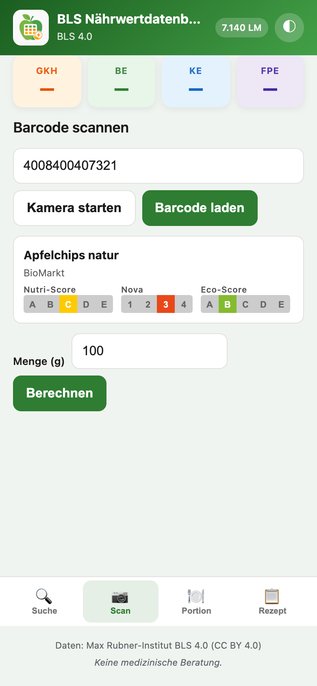
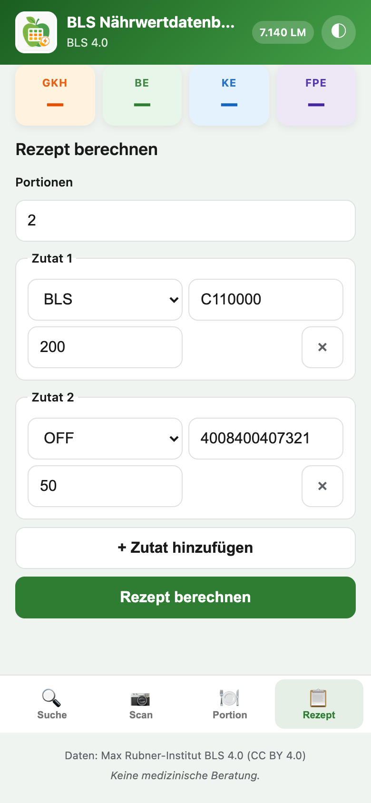
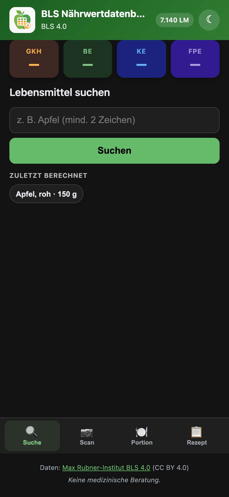

# Home Assistant Add-on: BLS Nährwertdatenbank

## About

Das Add-on stellt die deutsche BLS 4.0 Nährwertdatenbank lokal in Home Assistant bereit — mit WETID-inspirierten Diabetes-Einheiten und Barcode-Scanner über Open Food Facts.

## Einschränkungen

- BLS enthält ~7.140 Grundlebensmittel (keine 350k wie WETID)
- Barcode-Lookup benötigt Internet und deckt primär Packungsprodukte ab
- Keine Insulin-Dosierungsempfehlung — nur Nährwertberechnung

## Installation

### Add-on

1. **Einstellungen** → **Add-ons** → **Add-on Store** → Repository hinzufügen
2. **BLS Nährwertdatenbank** installieren und starten
3. Ingress-Tab öffnen oder `http://<host>:8090/health` prüfen

Beim ersten Start lädt das Add-on die BLS-Daten von [blsdb.de](https://blsdb.de/download). Das kann 5–15 Minuten dauern.

## Schnellstart (Home Assistant)

Checkliste für die vollständige Einrichtung:

1. **Add-on installieren** — Repository `https://github.com/henryhst/hassio-addons` → **BLS Nährwertdatenbank** installieren und starten
2. **Ingress prüfen** — Add-on öffnen oder `http://<host>:8090/health` (Status `ok`)
3. **Integration hinzufügen** — Einstellungen → Geräte & Dienste → Integration hinzufügen → **BLS Nährwertdatenbank** → Host `bls_nutrition`, Port `8090`
4. **Helper-Paket** (optional, für Lovelace-Dashboard) — `integration/packages/bls_nutrition.yaml` nach `config/packages/` kopieren und Home Assistant neu starten
5. **Dashboard** — Nach Integration erscheint **BLS Nährwert** unter Dashboards (oder manuell importieren)

Erwartete Sensoren: `sensor.bls_nutrition_food_count`, `sensor.bls_nutrition_g_kh`, …

## Add-on aktualisieren

Updates werden als vorgefertigtes Container-Image von GitHub Container Registry bezogen (`ghcr.io/henryhst/hassio-addons/bls_nutrition`).

1. **Einstellungen** → **Add-ons** → **Add-on Store** → **⋮** → **Aktualisieren** (Repository neu einlesen)
2. **BLS Nährwertdatenbank** → **Update** (falls angeboten)
3. Nach dem Update das Add-on **neu starten**

Bei Fehlern: **Einstellungen** → **System** → **Protokolle** → **Supervisor** — typische Meldungen sind `manifest unknown` (Image noch nicht gebaut) oder `Failed to build` (lokaler Fallback-Build).

## Ingress-Web-UI (Hauptoberfläche)

Das Add-on stellt über **Ingress** eine mobil-optimierte Web-App bereit — in der Home-Assistant-App
unter **Add-ons → BLS Nährwertdatenbank → Öffnen** oder im Sidebar-Panel **BLS Nährwert**.

### Zugriff

- **Sidebar-Panel** „BLS Nährwert“ — für **alle Home-Assistant-Benutzer** sichtbar (nicht nur Admins)
- Nach einem Update das Add-on neu starten
- Fehlt der Eintrag in der Sidebar: **Add-on → Info → „Zur Sidebar hinzufügen“**


### Oberfläche im Überblick

| Bereich | Beschreibung |
|---------|--------------|
| **Header** | Logo, Titel, BLS-Version, Lebensmittel-Badge, Theme-Toggle (Hell/Dunkel/System) |
| **Hero-Tiles** | gKH, BE, KE, FPE — WETID-inspirierte Diabetes-Einheiten, immer sichtbar |
| **Hauptbereich** | Suche, Scan, Portion, Rezept oder Map (je nach Tab) |
| **Bottom-Nav** | Suche · Scan · Portion · Rezept · Map (optional) |

### Lebensmittelsuche

Live-Suche ab 2 Zeichen (Debounce), parallel in **BLS 4.0** (lokal) und **Open Food Facts** (Internet):


1. Suchbegriff eingeben — Ergebnisse erscheinen automatisch (oder **Suchen** tippen)
2. Treffer antippen → Quick-Portion mit Chips **50 / 100 / 150 g** und eigener Menge
3. Layout über `search_layout` (`stacked` oder `side_by_side`)
4. **Zuletzt berechnet**-Chips unter dem Suchfeld (optional per `search_recents_enabled`)

### Barcode scannen

EAN manuell eingeben oder per **Kamera starten** (Browser mit `BarcodeDetector`):



### Portion und Ergebnis

Nach der Berechnung aktualisieren sich die Hero-Tiles. Nährwertdetails erscheinen unter **Details**:


| Schritt | Aktion |
|---------|--------|
| Quelle wählen | BLS, Open Food Facts oder eigenes Lebensmittel |
| ID / Code | BLS-Code (z. B. `F110000`) oder OFF-Barcode |
| Menge | Gramm eingeben → **Berechnen** |

### Rezept

Dynamische Zutatenliste — beliebig viele Zeilen mit Quelle (BLS/OFF/Eigen), Code und Gramm:



### Dark Mode

Theme-Toggle im Header: System · Hell · Dunkel (`localStorage`):



### Map (Supermärkte)

Optionaler Map-Tab mit OpenStreetMap-Karte. Das Add-on nutzt den Home-Assistant-Standort
(`latitude`/`longitude`, `time_zone`) und lädt Supermärkte per Overpass API im konfigurierten Radius
(`map_radius_km`, max. 50 km).

**Marker-Farben** (aktueller Öffnungsstatus nach OSM-Daten und HA-Zeitzone):

| Farbe | Bedeutung |
|-------|-----------|
| Blau | Home-Assistant-Standort |
| Grün | Supermarkt aktuell geöffnet |
| Rot | Supermarkt geschlossen (oder Feiertag am HA-Standort) |
| Grau | Keine Öffnungszeiten in OpenStreetMap |

Marker-Popups zeigen **Öffnungszeiten** aus OpenStreetMap (`opening_hours` / `opening_hours:de`):

| Situation | Anzeige |
|-----------|---------|
| Werktag / Samstag | Nur **heute**, z. B. `Heute (Di): 08:00–20:00` |
| Sonntag | **Ganze Woche** (Mo–So, je eine Zeile) |
| Feiertag am HA-Standort | `Geschlossen (Feiertag)` (optional mit Feiertagsname) |
| Kein OSM-Tag | `Keine Angabe in OpenStreetMap` |

Feiertage werden anhand der Home-Assistant-Zeitzone und des Standorts ermittelt
(Bundesland per einmaligem Nominatim-Reverse-Geocoding, Ergebnis in `/data/map_location_cache.json`).
OSM-Öffnungszeiten können unvollständig oder veraltet sein.

### Weitere Bereiche

| Tab | Funktion |
|-----|----------|
| **Scan** | EAN/Barcode oder Kamera → OFF-Produkt laden, Menge setzen, berechnen |
| **Rezept** | Dynamische Zutatenliste und Portionenanzahl |
| **Map** | Supermärkte im Umkreis des HA-Standorts (optional via `map_enabled`) |

### Nutri-Score, Nova-Score und Eco-Score

Bei **Open-Food-Facts-Produkten** zeigt die Ingress-UI optional drei Bewertungen als SVG-Badges:

| Score | OFF-Feld | Werte |
|-------|----------|-------|
| Nutri-Score | `nutrition_grades` | A–E |
| Nova-Score | `nova_group` | 1–4 |
| Eco-Score | `ecoscore_grade` / `environmental_score_grade` | A–E |

Anzeige in OFF-Suchergebnissen, nach Barcode-Scan und in den Portion-Details. BLS-Grundlebensmittel haben keine Scores.

**Rechtlicher Hinweis:** Nutri-Score ist ein eingetragenes Kollektivzeichen (Santé publique France).
Die Badges dienen der **Wiedergabe von OFF-Daten** zu Informationszwecken, nicht der eigenen Produktkennzeichnung.
Nova-Score und Eco-Score stammen ebenfalls aus Open Food Facts.

Im Lovelace-Dashboard stehen die Sensoren `sensor.bls_nutrition_nutriscore`, `_nova` und `_ecoscore` bereit.

### Einkaufsliste (To-do)

OFF-Produkte können per Button **„Zur Einkaufsliste“** in eine Home-Assistant-To-do-Liste importiert werden:

- OFF-Suchergebnisse (rechte Spalte)
- Barcode-Ergebnis
- Portion-Details (nach OFF-Berechnung)

Der Eintrag enthält den Produktnamen; in der Beschreibung stehen Barcode und Marke (`OFF · EAN · Marke`).

**Entity-ID finden:** Einstellungen → To-do-Listen → Liste öffnen → Entwicklerwerkzeuge → Zustand (`todo.einkaufsliste` o. ä.).

Add-on-Optionen:

| Option | Default | Beschreibung |
|--------|---------|--------------|
| `todo_list_enabled` | `true` | Button anzeigen |
| `todo_list_entity_id` | `todo.shopping_list` | Ziel-To-do-Entity |

> Das **Lovelace-Dashboard** der Integration bleibt eine separate Oberfläche für Automatisierungen
> und feste Sensoren (siehe unten).

Screenshots neu erzeugen (Maintainer): [`docs/snapshots/capture.sh`](docs/snapshots/capture.sh) — siehe [`docs/snapshots/README.md`](docs/snapshots/README.md)

### Custom Integration

> **HACS-Hinweis:** Das Repository `henryhst/hassio-addons` ist ein **Add-on Repository**
> (`repository.json` im Root). HACS kann es **nicht** als Integration hinzufügen.

#### Option A: Manuelle Installation (empfohlen)

Kopiere den Ordner `integration/custom_components/bls_nutrition` nach
`config/custom_components/bls_nutrition` (inkl. `brand/icon.png`) und starte Home Assistant neu.

#### Option B: HACS

Verwende ein **separates** Integrations-Repository. Siehe
[`integration/HACS_PUBLISH.md`](integration/HACS_PUBLISH.md) und
[`integration/README.md`](integration/README.md) für die Veröffentlichung als
eigenes GitHub-Repo (z. B. `homeassistant-bls-nutrition`).

### Integration einrichten

1. **Einstellungen** → **Geräte & Dienste** → **Integration hinzufügen**
2. **BLS Nährwertdatenbank** wählen
3. Host: `bls_nutrition` (Supervisor-intern), Port: `8090`
4. Optional: **Konfigurieren** → Host/Port oder Standard-Barcode-Menge (g) anpassen

Services `search_food`, `lookup_barcode`, `calculate_portion` und `calculate_recipe` liefern eine **Antwort** (kein Event-Polling nötig). Bei mehreren Integrationen `config_entry_id` angeben.

## Configuration

```yaml
auto_update: true
update_interval_days: 30
language: de
enable_open_food_facts: true
off_cache_ttl_days: 90
off_search_cache_ttl_days: 7
search_layout: stacked
search_recents_enabled: true
todo_list_enabled: true
todo_list_entity_id: todo.shopping_list
map_enabled: false
map_radius_km: 20
```

| Option | Werte | Beschreibung |
|--------|-------|--------------|
| `off_cache_ttl_days` | `1`–`365` | Gültigkeit des **Barcode**-Caches in SQLite (`off_products`, `off_barcode_miss`) |
| `off_search_cache_ttl_days` | `1`–`90` | Gültigkeit des **Textsuche**-Caches (`off_search_cache`); kürzer als Barcode-Cache empfohlen |
| `search_layout` | `stacked`, `side_by_side` | `stacked`: BLS und OFF untereinander; `side_by_side`: nebeneinander |
| `search_recents_enabled` | `true`, `false` | Chips „Zuletzt berechnet“ unter dem Suchfeld in der Ingress-UI |
| `todo_list_enabled` | `true`, `false` | Button „Zur Einkaufsliste“ in der Ingress-UI |
| `todo_list_entity_id` | z. B. `todo.shopping_list` | Ziel-Entity der HA-To-do-Liste |
| `map_enabled` | `true`, `false` | Optionalen Map-Tab in der Ingress-UI anzeigen |
| `map_radius_km` | `1`–`50` | Radius in km fuer Supermarkt-Suche um den HA-Standort |

### Caching (Open Food Facts)

Alle Caches liegen persistent in `/data/bls.sqlite`:

| Cache | Tabelle | Option | Verhalten |
|-------|---------|--------|-----------|
| Barcode-Produkt | `off_products` | `off_cache_ttl_days` | Treffer aus Cache, API nur bei Ablauf oder erstem Lookup |
| Unbekannter Barcode | `off_barcode_miss` | `off_cache_ttl_days` | Kein erneuter OFF-API-Call für dieselbe EAN innerhalb der TTL |
| Textsuche (Query) | `off_search_cache` | `off_search_cache_ttl_days` | Komplette Suchergebnisliste pro Suchbegriff |
| Textsuche (lokal) | `off_products` | — | Vor API-Call: bereits gespeicherte Produkte nach Name/Marke durchsuchen |

BLS-Suche nutzt einen **FTS5-Volltextindex** (`foods_fts`), der beim Import bzw. beim ersten Start nachzieht.

## Services

### `bls_nutrition.search_food`

```yaml
service: bls_nutrition.search_food
data:
  query: Apfel
  limit: 10
```

Feuert Event `bls_nutrition_search_result`.

### `bls_nutrition.lookup_barcode`

```yaml
service: bls_nutrition.lookup_barcode
data:
  barcode: "4008400407321"
```

### `bls_nutrition.calculate_portion`

```yaml
service: bls_nutrition.calculate_portion
data:
  source: bls
  id: "F110000"
  amount_g: 150
```

Feuert Event `bls_nutrition_calculation_result` mit gKH, BE, KE, FPE.

### `bls_nutrition.calculate_recipe`

```yaml
service: bls_nutrition.calculate_recipe
data:
  servings: 2
  ingredients:
    - source: bls
      id: "F110000"
      amount_g: 200
    - source: bls
      id: "M711000"
      amount_g: 50
```

### `bls_nutrition.add_to_todo_list`

Fügt ein OFF-Produkt zur konfigurierten Home-Assistant-To-do-Liste hinzu (auch per Automatisierung nutzbar):

```yaml
service: bls_nutrition.add_to_todo_list
data:
  name: Kölln Haferflocken
  barcode: "4008400407321"
  brand: Kölln
  entity_id: todo.shopping_list
```

## Dashboard

Nach Installation der Integration und des Helper-Pakets steht das Dashboard **BLS Nährwert**
unter **Dashboards** zur Verfügung (wird über `manifest.json` automatisch registriert).

### 1. Helper-Paket einbinden

Kopiere [`integration/packages/bls_nutrition.yaml`](integration/packages/bls_nutrition.yaml) nach
`config/packages/bls_nutrition.yaml` und aktiviere Packages in `configuration.yaml`:

```yaml
homeassistant:
  packages: !include_dir_named packages
```

Home Assistant neu starten.

### 2. Dashboard öffnen

**Dashboards → BLS Nährwert** (Pfad: `/lovelace/bls-nutrition`)

### Funktionen

| Bereich | Beschreibung |
|---------|--------------|
| Suche | Lebensmittel in BLS suchen, Trefferliste anzeigen |
| Barcode | Open-Food-Facts-Lookup (pro 100 g) |
| Portion | Quelle + ID + Menge → gKH/BE/KE/FPE + Nährwerte |
| Rezept | Bis zu 3 Zutaten, Script aggregiert und berechnet |

### Sensoren (feste Entity-IDs)

| Entity | Bedeutung |
|--------|-----------|
| `sensor.bls_nutrition_food_count` | Anzahl BLS-Lebensmittel |
| `sensor.bls_nutrition_g_kh` | Letzte Berechnung: gKH |
| `sensor.bls_nutrition_be` | Letzte Berechnung: BE |
| `sensor.bls_nutrition_ke` | Letzte Berechnung: KE |
| `sensor.bls_nutrition_fpe` | Letzte Berechnung: FPE |

Sensoren aktualisieren sich automatisch nach Service-Aufrufen vom Dashboard.

## Diabetes-Einheiten

| Einheit | Formel |
|---------|--------|
| gKH | Kohlenhydrate in Gramm |
| BE | gKH / 12 |
| KE | gKH / 10 |
| FPE | (Fett×9 + Protein×4) / 100 |

## Datenquellen & Lizenzen

| Quelle | Lizenz | Attribution |
|--------|--------|-------------|
| BLS 4.0 | CC BY 4.0 | Max Rubner-Institut, DOI: 10.25826/Data20251217-134202-0 |
| Open Food Facts | ODbL | openfoodfacts.org |

## Support

- [GitHub Issues](https://github.com/henryhst/hassio-addons/issues)
- [Home Assistant Community](https://community.home-assistant.io)
